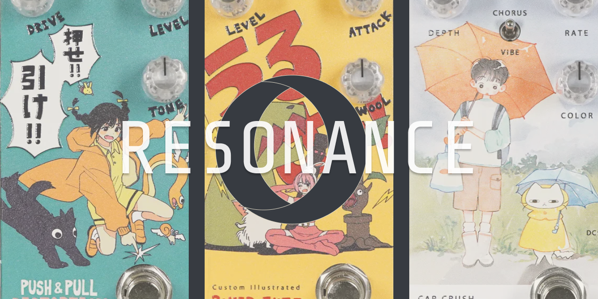

## 1&nbsp;&nbsp;: resonance
The idea for *Resonance* came while I was watching keshi's [*GABRIEL*](https://www.youtube.com/watch?v=Gt_x9ifcWpM) documentary. In the background, I heard a beautiful tune that wasn't listed of any track on the album, and I couldn't find it anywhere else. I wasn't musically gifted, so I wished I could learn to play it.

That's when I thought: what if I made a product that could take a sound and turn it into something you could play on the guitar?

Resonance is a guitar conversion tool that takes `.wav` files and transcribes them into music notes, which can then be used as tabs for learning and playing. Its been tested on acoustic guitar but was designed with future support for electric and bass in mind. Learning by ear can be frustrating; Resonance makes the process easier by bridging the gap between what you hear and what you can play.

**Please feel free to send feedback, I'd love to know how I can improve!**

 

### Future Plans

> - electric, bass, more  
> - `.mp3` file support  
> - note → TAB conversion

## 2&nbsp;&nbsp;: sample

  
  

## 3&nbsp;&nbsp;: architecture

backend: python + fastapi
pydub (audio decoding), crepe (pitch detection), librosa (frequency to notes)

frontend: react + vite, tailwindcss

